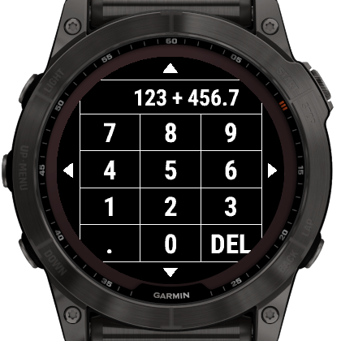
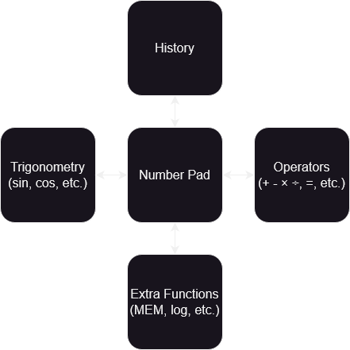

# Lx Calculator

A touch calculator app for Garmin devices.

## Features

- Large, easy to press buttons
- Physical button based shortcuts
- Automatically saving history for recall
- Trigonometry functions: sin, cos, tan, asin, acos, atan, pi, e, ln, log

## How to Use

The central view contains the number pad. To switch to another page:

- Swipe in a direction, or
- Tap the arrows on the edge of the display, or
- Press the UP or DOWN buttons

Pages have small arrows around the edge to indicate other pages.

## Button mapping

- UP: Move to the left page
- DOWN: Move to the right page
- START: Calculate the current formula
- Holding UP / MENU: Main Menu

## Settings

Settings can be adjusted from the Connect IQ app on your phone, or by
long-pressing the MENU button and going to the "Settings" menu.

- Switch after setting Operator
    - If set, the view will reset to the main number pad once an operator has
      been chosen.
- Vibration
    - If set, button presses will cause a small vibration.

# Developer Documentation

## Preparing a release

To perform a release:

- Create an entry in [CHANGELOG.md](CHANGELOG.md) under the next version
- Update the version number for `AppVersion` in
  [resources/strings.xml](resources/strings.xml).
- Commit with `Version x.x.x`
- Tag that commit as `vx.x.x`
