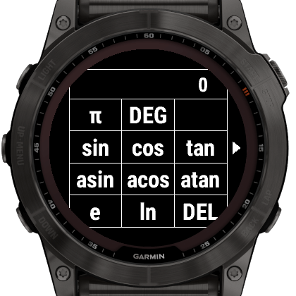

# Lx Calculator

A touch calculator app for Garmin devices.

## Features

- Large, easy to press buttons
- Physical button based shortcuts
- Automatically saving history for recall
- Trigonometry functions: sin, cos, tan, asin, acos, atan, pi, e, ln, log
  - With support for degrees, radians, and gradians
- Memory that can be set, recalled, and added to
- Unit conversions between physical units; convert metres to yards, litres to
  pints, celsius to fahrenheit, and more!
- Useful shortcuts for quick actions:
  - Press START or tap the answer box to quickly get the answer
  - Long hold on `DEL` to delete the current input

## How to Use

The central view contains the number pad. To switch to another page:

- Swipe in a direction, or
- Tap the arrows on the edge of the display, or
- Press the UP or DOWN buttons

Pages have small arrows around the edge to indicate other pages.

To get to the **Main Menu**, hold the UP button.

## Button mapping

- UP: Move to the left page
- DOWN: Move to the right page
- START: Calculate the current formula
- Holding UP / MENU: Main Menu

## Settings

Settings can be adjusted from the Connect IQ app on your phone, or by
long-pressing the MENU button and going to the "Settings" menu.

- Switch after setting Operator
    - If set, the view will reset to the main number pad once an operator has
      been chosen.
- Vibration
    - If set, button presses will cause a small vibration.
- Screen Transitions
    - If set, moving pages will show an animation. Disable to speed up moving
      around the app.

Developer Documentation

## Preparing a release

To perform a release:

- Create an entry in [CHANGELOG.md](CHANGELOG.md) under the next version
- Update README.md with features / screenshots
- Update the version number for `AppVersion` in
  [resources/strings.xml](resources/strings.xml).
- Commit with `Version x.x.x`
- Tag that commit as `vx.x.x`

## Creating screenshots

- Use the latest Fenix X watch in the simulator
- Screenshot with an external program (to capture the border as well)
- Using GIMP:
  1. Create a selection around the 280x280 pixels of the screen
  2. Grow the selection by 70 pixels
  3. Using the Fuzzy Select Tool
    - Antialiasing enabled
    - Feather edges set to `2.0`
    - Threshold set to `50`
  4. Remove the white exterior

## Screenshots

